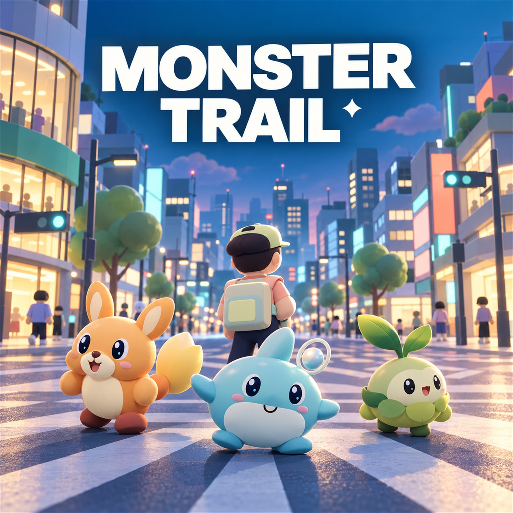

# MONSTER TRAIL



ポートフォリオ用の正方形サムネイル（1600×1600px）: [軽量JPG](public/monster-trail-portfolio-1600.jpg) / [高画質PNG](public/monster-trail-portfolio-1600.png)。

**ブラウザで遊ぶ:** https://kenkenta51-max.github.io/monster-trail/

**キャラクターと技を見る:** https://kenkenta51-max.github.io/monster-trail/showcase.html

**主人公の専用3Dモデルを見る:** https://kenkenta51-max.github.io/monster-trail/player.html

**虹街の住人12人の3Dモデルを見る:** https://kenkenta51-max.github.io/monster-trail/citizens.html

ネオンが灯る架空都市「虹街」を、モンスターの相棒と自由に歩く、オリジナルの3Dモンスター収集RPGプロトタイプです。街・人物・モンスター・看板・効果音はコードで制作。既存作品の画像、モデル、音楽、ロゴは使用していません。

ブラッシュアップ版では、滑らかなキャラクターモデル、種類別の性格と待機動作、まばたき、6技の専用モーション・エフェクトを追加しました。分析と残りの改善項目は [BRUSHUP_PLAN.md](BRUSHUP_PLAN.md) にまとめています。

`/showcase.html`（タイトル画面の「モンスターと6つの技を見る」）で、3体を切り替えて技を再生できます。スロー再生と「6つの技を連続再生」を用意しています。連続再生は、各技の命中が1回であること、位置の復元、エフェクトの解放も検証します。ゲームのセーブには影響しません。

主人公「TRAIL RUNNER」はオリジナルの専用GLBモデルです。人間らしい頭身を目標に約6頭身へ変更し、顔と手のサイズを抑え、長い脚、分離した肘・膝の関節、開いたジャケットと装備の細部を加えました。モデル内蔵の待機／歩行／走行クリップを使用します。`/player.html` で回転・拡大しながらモーションを確認できます。読み込みに失敗した場合は従来のコード製モデルでプレイを継続します。

街の12人のNPCも、人間寄りの頭身と滑らかな輪郭を持つ個別の3Dキャラクターに変更しました。髪型・服装・小物で職業を区別し、歩行中は腕・肘・脚・膝が動きます。街中で会話できるほか、`/citizens.html` で1人ずつ回転・拡大しながら待機／歩行を確認できます。NPCは共有ジオメトリを利用するコード製モデルで、個別GLBファイルではありません。

街のグラフィックは、建物の窓を奥行きのある枠とガラス面に変え、階の張り出し、店舗の庇とショーウィンドウ、屋上設備を追加しました。道路のアスファルトと歩道の石材はブラウザで生成する繰り返し模様を使い、横断歩道の点字ブロック、排水溝、マンホール、カフェのテーブル、枝分かれした街路樹も配置しています。実在都市の建物やロゴ、写真素材は使用していません。

## 起動

Node.js 20.19以降が必要です。PowerShellまたはターミナルでこのフォルダに移動します。

```sh
npm install
npm run dev
```

表示された **http://127.0.0.1:5173/** を開いて `START GAME` を押します。Chrome / Edge等、WebGL 2対応のPCブラウザを推奨します。HTMLのダブルクリックではなく、ローカルサーバーを通して開いてください。

```sh
npm run build     # 配布用の dist/ を生成
npm run preview   # http://127.0.0.1:4173/ でビルドを確認
npm test          # ゲームルール・技と演出の7件のテスト
npm run model:player # 主人公GLBを再生成
```

インストール後はゲームの実行に外部API・CDN接続・有料素材を必要としません。フォントもOSのローカルフォントを使用します。`package-lock.json` に依存バージョンを固定しています。

## 操作

| 操作 | キー・入力 |
| --- | --- |
| 移動 | WASD / 矢印キー |
| 走る | Shift を押しながら移動 |
| 会話・会話を閉じる | E / Enter |
| カメラを回す | フィールドを左右にドラッグ / Q・R |
| 仲間を見る・切り替える | M / 右上「仲間」 |
| 操作説明・画面を閉じる | Esc / 右上「?」 |
| 戦闘のコマンド | ボタンをクリック / TabとEnter |
| 効果音 | 右上 SOUND / ♪ ボタン（初期はOFF） |

移動方向はカメラ基準です。キーを離すと停止します。画面が非アクティブになった場合も入力を解除します。スマートフォン専用のタッチ移動は未実装です。

## 最初の冒険

1. 開始地点にいる白衣の研究家・ナギに近づき、Eで話します。
2. 西側の「こもれび公園」へ歩き、緑の光の輪を探索します。
3. 歩いた距離に応じて野生のLeafyに遭遇。止まっているだけでは遭遇しません。長く歩いても出会えない状態を防ぐ上限も設けています。
4. 「たたかう」で技を選び、HPを減らします。「アイテム → リンクプリズム」で仲間にできます。HPを減らすほど成功しやすくなります。
5. 「街の探索に戻る」で探索に復帰。Mで仲間を切り替えられます。
6. 北東の「駅前プラザ」でAquari、南東の「ひだまり路地」でFlamoに会えます。3種類をそろえると探索目標を達成できます。

HPや道具が少なくなったら、北西の `cafe komorebi` 前にいるカフェ店員・ハルに話しかけてください。全員のHPが回復し、ポーションは最低5個、リンクプリズムは最低8個まで無料で補充されます。

## 実装済み機能

- 夜景の3Dタイトル、START GAME / セーブがあればCONTINUE TRAIL。
- カラフルな現代都市。スクランブル交差点、斜めと縦横の横断歩道、高層・商業ビル、駅入口、カフェ、ショップ、路地、公園、地下入口、街路樹、自販機、ベンチ、信号、街灯、道路、歩道、電子看板。舗装模様と建物の奥行き、街路の細部をコードで制作。
- 専用GLBモデルの主人公と待機・歩行・走行アニメーション。三人称追従カメラ、建物と街の小物の衝突判定、カメラの建物めり込み回避。
- 個別の台詞と職業別3Dモデルを持つ12人のNPC。会社員、学生、観光客、店員、ミュージシャン、買い物客、犬の散歩、スケーター、警備員、研究家、花屋、配達員。うち6人が周辺を歩きます。
- 車の走行、信号の切り替え、樹冠の揺れ、看板の発光、出現スポットの浮遊粒子。
- 3種類の完全オリジナル3Dモンスターと連れ歩き。
- 距離に応じた確率遭遇、画面切り替え演出、戦闘後の遭遇猶予。
- ターン制戦闘、属性相性、各種2技、敵の反撃、HPバー、回復、捕獲、逃走、勝利経験値、レベルアップ。
- 戦闘不能時は残りの仲間に自動交代。全員が倒れると研究家前で全回復して再開します。
- 仲間図鑑、パートナー切り替え、操作ガイド、ミニマップ、探索目標。
- ブラウザのLocalStorageに自動セーブ。壊れたデータは検証して安全な初期値で再開。
- Web Audioで生成するオリジナル効果音と静かな音のモチーフ。
- 静的な街の形状を材質ごとに結合し、描画負荷を軽減。

| モンスター | 属性 | Lv.5 HP | 攻撃 | 防御 | 技 |
| --- | --- | ---: | ---: | ---: | --- |
| Flamo | 炎 | 44 | 13 | 8 | スパークテイル / ぽかぽかタックル |
| Aquari | 水 | 50 | 10 | 11 | バブルリズム / ころころアタック |
| Leafy | 草 | 47 | 11 | 10 | リーフスピン / どんぐりショット |

相性は **炎 → 草 → 水 → 炎**。有利は1.5倍、不利は0.7倍。通常技は相性に左右されません。捕獲は各種類1体までです。

## ゲーム構成

```text
index.html          タイトル、探索HUD、会話、戦闘、仲間、ガイド
src/main.js         ゲーム状態、入力、カメラ、遭遇、戦闘、保存、音
src/player-model.js 専用GLBの読み込み・モーション切り替え・代替モデル
scripts/build-player-model.mjs オリジナルGLBモデルと3クリップの生成
public/models/trail-runner.glb 主人公モデル本体
player.html / src/player-preview.js 主人公モデルの3Dプレビュー
src/world.js        街とNPC、環境アニメーション、戦闘アリーナ
src/city-surfaces.js 道路と歩道のオリジナル生成テクスチャ
src/npc-models.js 12人の職業別3Dモデルと歩行アニメーション
citizens.html / src/citizens-preview.js 住人12人の3Dプレビュー
src/models.js       人物と3種類のモンスターの形状・アニメーション
src/battle-effects.js 6技の予備動作・発射・命中・被弾と後片付け
showcase.html       キャラクターと技のアトリエ
src/showcase.js     技のプレビュー・スロー・連続検証
src/rules.js        能力値、属性、ダメージ、捕獲、経験値、衝突、保存検証
src/style.css       UIと画面幅に応じたスタイル
tests/rules.test.js  Node.js標準テストランナーによるルール検証
tests/browser.html  ブラウザ内の入力イベントで行う通しプレイ検証
```

Three.js + JavaScript ES Modules + Viteを使用。UIはHTML/CSSです。ゲーム進行は `title → field → dialog / battle / collection / help → field` の状態で管理しています。

開発サーバーの `/tests/browser.html` を開いて `RUN PLAYTHROUGH` を押すと、別の検証用セーブ領域を使って探索・会話・捕獲・回復・衝突・勝利・復帰・再読み込み・逃走を検証できます。ゲーム内の読み取り専用 `window.monsterTrail.getState()` は状態と描画情報を返します。検証ページは本番ビルドには含まれません。

セーブは開いたオリジンごとに異なります（5173と4173、localhostと127.0.0.1では別の保存領域）。新しく始めたい場合は開発者ツールのApplication / Local Storageから、このゲームの `monster-trail-save-v1` だけを削除してください。

## 今後追加できる機能

- 会話の分岐、依頼、街の物語、ショップでの買い物。
- より多いモンスター、進化、図鑑の発見演出、戦闘中の任意交代。
- 建物の室内、屋上、地下通路の探索、昼夜の変化。
- NPCの経路探索、より高度なカメラの障害物回避。
- ゲームパッド、モバイル用タッチ操作、音量調整。

今回は1つの街で遊べるプロトタイプです。屋内への入場、オンライン機能、クラウドセーブ、大規模なストーリーは含みません。主人公は専用GLBモデル、NPCとモンスターはコード製の曲面モデルです。設定画そのものを立体化した高精細スキャンではありません。連続メッシュのボーン変形、表情用モーフ、服・肌のテクスチャ、街全体の写実的な素材への置き換えは今後の工程です。
